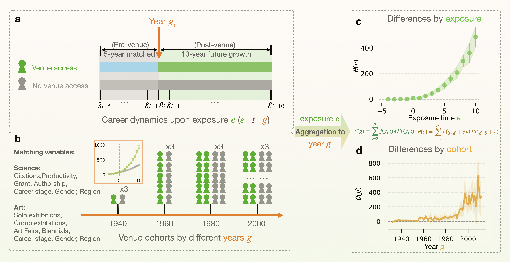

# The Venue Effect in Science and Art

> The provided code and data are designed to investigate the impact of prestigious venues in science and the arts. We aim to deepen understanding of how venues influence individual career trajectories and their role in shaping opportunities and outcomes.



## Authors

Yixuan Liu, Rodrigo Dorantes-Gilardi, Larry Han, and Albert-László Barabási.

## Description

This repository contains the analysis pipeline for studying the venue effect across two domains — scientific publishing and visual art exhibitions. It includes code for data preprocessing, matching, causal estimation, and visualization.

**Data sources:**
- [Dimensions.ai](http://Dimensions.ai) — scientific research database
- [Artfacts.net](http://Artfacts.net) — art exhibitions and market database

**Software:**
- `Python 3.11.8`
- `R` (optional, for robustness checks via `csdid`)

## Repository Structure

```
venue_effect/
├── README.md
├── LICENSE
├── 0-diagram.png
│
├── science/                          # Science venue effect pipeline
│   ├── preprocess/
│   │   └── preprocess_science.ipynb      # Data cleaning and panel construction
│   │
│   ├── matching/
│   │   ├── matching.py                   # Main matching engine (CEM + DTW)
│   │   ├── inspect_columns.py            # Data inspection utility
│   │   ├── run_matching.sh               # Shell wrapper for batch matching
│   │   ├── enrich_citations.py           # Citation enrichment
│   │   ├── enrich_l2_field.py            # Field-level enrichment
│   │   ├── enrich_novelty.py             # Novelty metric enrichment
│   │   └── README_matching.md            # Matching methodology documentation
│   │
│   ├── did/
│   │   ├── venue_did_csdid.py            # DiD estimation (Callaway & Sant'Anna 2021)
│   │   ├── venue_did_csdid_dynamic.py    # Dynamic event-study DiD
│   │   ├── venue_did_r_python_wrapper.py # R integration wrapper
│   │   ├── venue_did_r_dynamic.R         # R implementation of dynamic DiD
│   │   └── README_did_pipeline.md        # DiD pipeline documentation
│   │
│   └── plot/
│       ├── plot_effect_heterogeneity.ipynb  # Heterogeneity analysis plots
│       ├── plot_matched_decade.ipynb        # Temporal effect analysis
│       ├── plot_matched_general.py          # General plotting utility
│       └── run_plots.sh                     # Batch plotting script
│
└── art/                              # Art venue effect pipeline
    ├── preprocess/
    │   └── preprocess_biennale.ipynb     # Biennale data preprocessing
    │
    ├── matching/
    │   ├── matching_art.py               # Art matching engine (CEM + DTW)
    │   ├── enrich_titles.py              # Title enrichment for art pieces
    │   └── README_matching_art.md        # Art matching methodology documentation
    │
    ├── did/
    │   ├── venue_did_csdid_art.py        # DiD estimation for art venues
    │   └── venue_did_csdid_dynamic_art.py # Dynamic event-study DiD for art
    │
    └── plot/
        ├── plot_effect_heterogeneity_art.ipynb  # Art heterogeneity plots
        └── plot_matched_decade.ipynb             # Art temporal effect plots
```

## Pipeline Overview

The analysis follows four stages, applied in parallel for both science and art:

**1. Preprocessing** → **2. Matching** → **3. DiD Estimation** → **4. Visualization**

### Stage 1: Preprocessing

Notebooks that clean raw data and construct balanced panel datasets for matching.

- **Science:** `science/preprocess/preprocess_science.ipynb` — loads publication records from Dimensions.ai, constructs cumulative career metrics (publications, citations, funding, corresponding authorships), and outputs treated/control parquet files.
- **Art:** `art/preprocess/preprocess_biennale.ipynb` — loads exhibition records from Artfacts.net, constructs cumulative exhibition counts (solo, group, fair, biennale), and outputs treated/control parquet files.

### Stage 2: Matching

Pairs each venue-participating individual with comparable controls using a hybrid **coarsened exact matching (CEM) + dynamic time warping (DTW)** scheme on pre-treatment career trajectories.

#### Science matching

```bash
# Inspect data columns
python science/matching/inspect_columns.py --field physics

# Test on a small sample (50 treated authors)
python science/matching/matching.py --field physics --journal_id jour.1018957 --test 50

# Full run with parallel processing
python science/matching/matching.py --field physics --journal_id jour.1018957 --n_jobs 32

# All journals for a field
bash science/matching/run_matching.sh physics 32
```

The matching algorithm:
1. **Blocking** on career age (±2 years), gender (exact), country (set overlap), and active status at treatment year
2. **DTW distance** on pre-treatment trajectories of cumulative publications, citations, funding, and corresponding authorships
3. **k-nearest neighbor selection** (default k=3)
4. **Covariate balance check** via absolute standardized difference (ASD < 0.1)

#### Art matching

```bash
# Test with 50 artists
python art/matching/matching_art.py --venue venice_biennale --test 50

# Full run with parallel processing
python art/matching/matching_art.py --venue venice_biennale --n_jobs 16

# All venues
python art/matching/matching_art.py --venue all --n_jobs 16
```

The art matching algorithm adapts the science pipeline:
1. **Blocking** on gender (exact), continent (flag overlap), and birth year (±5 years)
2. **CEM pre-filter** on solo and group exhibitions at year_diff = -1 (±30%)
3. **DTW distance** on pre-treatment trajectories of S (solo), G (group), F (fair), B (biennale) exhibitions
4. **k-nearest neighbor selection** (default k=3)

### Stage 3: Difference-in-Differences Estimation

Estimates causal venue effects using the Callaway & Sant'Anna (2021) heterogeneous difference-in-differences framework via the Python `csdid` package.

#### Science DiD

```bash
# Basic effect estimation
python science/did/venue_did_csdid.py \
    --input data/matches/enriched_citations/merged_physics_Nature_enriched.csv \
    --outcomes cum_citations_na cum_publication_count cum_funding_count

# With heterogeneity analyses (gender, career stage, region)
python science/did/venue_did_csdid.py \
    --input data/matches/enriched_citations/merged_physics_Nature_enriched.csv \
    --outcomes cum_citations_na cum_publication_count cum_funding_count \
    --heterogeneity gender career_stage region

# Dynamic event-study specification
python science/did/venue_did_csdid_dynamic.py \
    --input data/matches/enriched_citations/merged_physics_Nature_enriched.csv \
    --outcomes cum_citations_na
```

#### Art DiD

```bash
# Basic effect estimation for art venues
python art/did/venue_did_csdid_art.py \
    --input data/art/matches/matched_venice_biennale.csv \
    --outcomes S G F

# Dynamic event-study specification
python art/did/venue_did_csdid_dynamic_art.py \
    --input data/art/matches/matched_venice_biennale.csv \
    --outcomes S G F
```

Output CSVs contain ATT estimates, standard errors, confidence intervals, and p-values, organized by event time (dynamic), cohort (group), or overall (simple) aggregation.

### Stage 4: Visualization

Jupyter notebooks and Python scripts that produce the paper's figures.

- **Science:** `science/plot/plot_effect_heterogeneity.ipynb` (Figures 4–6: gender, career stage, geographic heterogeneity), `science/plot/plot_matched_decade.ipynb` (temporal effect analysis by decade), `science/plot/plot_matched_general.py` (general plotting utility)
- **Art:** `art/plot/plot_effect_heterogeneity_art.ipynb` (art heterogeneity analysis), `art/plot/plot_matched_decade.ipynb` (art temporal effects)

Batch plotting:
```bash
bash science/plot/run_plots.sh
```

## Dependencies

```
pandas >= 2.0
numpy >= 1.24
pyarrow >= 12.0
fastdtw >= 0.3.4
scipy >= 1.10
tqdm >= 4.60
csdid
matplotlib
seaborn
```

Install all dependencies:
```bash
pip install pandas numpy pyarrow fastdtw scipy tqdm csdid matplotlib seaborn
```

Optional (for robustness checks):
```bash
pip install pyfixest etwfe rpy2
```

## Data

Input data is expected under a `data/` directory at the repository root. After preprocessing:

- `data/matching_needed/` — treated and control parquet files for matching
- `data/matches/` — matched panels (output of the matching stage)
- `data/art/matches/` — matched art panels

Science venues include top journals such as Nature, Science, and PNAS across fields (physics, biology, chemistry, sociology). Art venues include top biennials such as the Venice Biennale, Documenta, Bienal de São Paulo, and others.

## References

- Callaway, B. & Sant'Anna, P.H. (2021). Difference-in-differences with multiple time periods. *Journal of Econometrics*, 225(2), 200–230.
- Tian, C., Huang, Y., Jin, C., Ma, Y. & Uzzi, B. (2025). The distinctive innovation patterns and network embeddedness of scientific prizewinners. *PNAS*, 122(40).
- Huang, J., Gates, A.J., Sinatra, R. & Barabási, A.-L. (2020). Historical comparison of gender inequality in scientific careers across countries and disciplines. *PNAS*, 117(9), 4609–4616.
- Rambachan, A. & Roth, J. (2023). A more credible approach to parallel trends. *Review of Economic Studies*, 90(5), 2555–2591.

## License

MIT License. See [LICENSE](LICENSE) for details.
